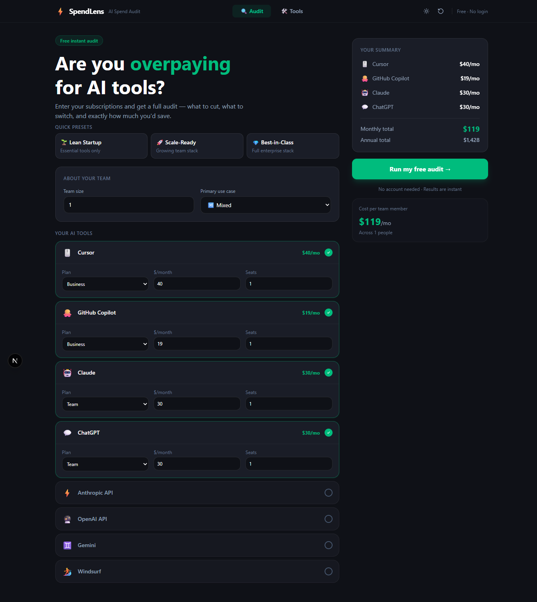
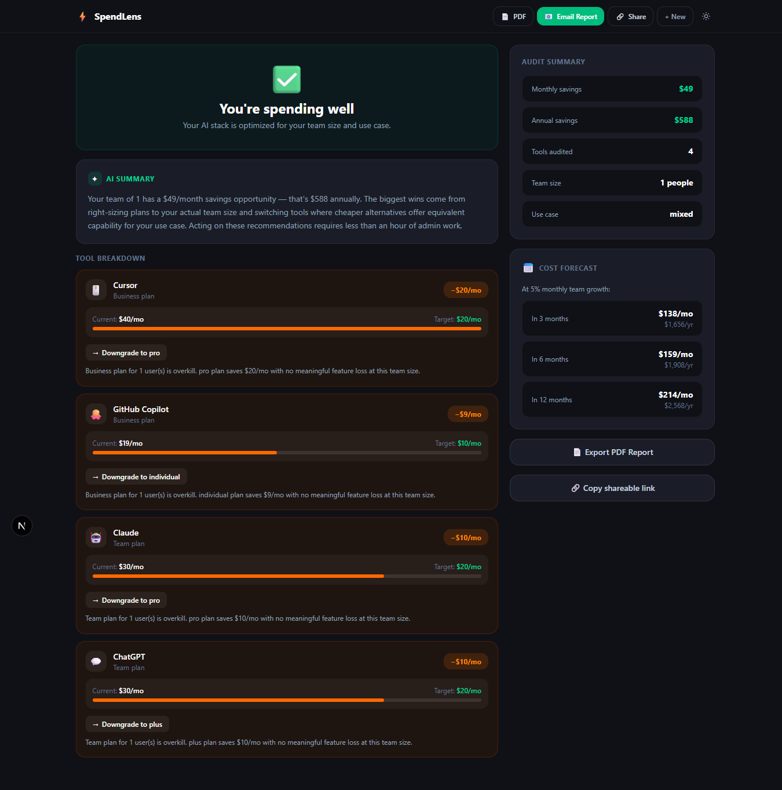
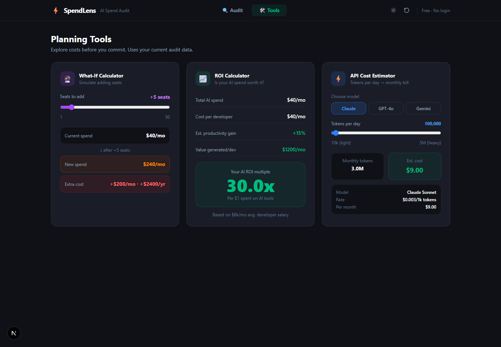

# SpendLensAI

A free tool that audits your team's AI tool subscriptions and identifies cost savings opportunities. Built for engineering managers and founders who are paying for 5+ AI tools with no clear picture of what they're getting per dollar.

🔗 **Live:** https://ai-spend-audit-lovat.vercel.app

---

## Screenshots






---

## What it does

Paste in your AI tools, plans, and monthly spend — the audit engine analyzes each tool against official pricing data and recommends:

- Downgrades when you're on an overkill plan for your team size
- Cheaper alternatives with comparable features
- Switching from retail pricing to credits for high-spend cases

Results are shareable via a unique URL, emailable as a report, and exportable as a PDF.

---

## Features

- Audit engine with pricing data for Cursor, GitHub Copilot, Claude, ChatGPT, Gemini, Windsurf
- AI-generated personalized summary via Anthropic Claude API
- Shareable results page via unique UUID-based URL
- Email report delivery via Resend
- PDF export of full audit report
- Lead capture with honeypot spam protection
- Dark/light mode, fully responsive
- Form state persists across page reloads via localStorage
- What-If Calculator, ROI Calculator, API Cost Estimator

---

## Tech Stack

- Next.js 15 (App Router)
- TypeScript
- Tailwind CSS
- Supabase (Postgres — audit + lead storage)
- Resend (transactional email)
- Anthropic Claude API (personalized audit summary)

---

## Decisions

**1. Hardcoded audit rules instead of asking Claude to do the math**
The audit engine uses deterministic rules and official pricing data to calculate savings. Claude is only used for the personalized summary paragraph. Using an LLM for financial calculations introduces hallucination risk — a wrong savings number undermines the entire product. Hardcoded rules are auditable, testable, and always correct. Knowing when not to use AI is part of the engineering judgment here.

**2. Next.js App Router over a simpler setup**
App Router gives us server-side rendering for the shareable results page (important for Open Graph previews) and API routes in the same repo. The trade-off is complexity — Server Components vs Client Components tripped me up early. Worth it because the shareable URL with proper OG tags is a core distribution mechanism, not a nice-to-have.

**3. Supabase over a simpler storage option**
Supabase gives a real Postgres database, a REST API, and Row Level Security out of the box. The trade-off is setup overhead versus something like a JSON file or localStorage-only approach. Chose it because lead capture needs a real backend — email addresses stored only in the browser is not a real product.

**4. Email captured after value shown, never before**
The form asks for spend data first, shows the full audit, and only then offers an email capture. This is a deliberate product decision — gating the audit behind email would kill conversion from cold traffic. The trade-off is that some users take the audit and leave without converting. Acceptable: the shareable URL is the secondary conversion mechanism.

**5. Honeypot over CAPTCHA for abuse protection**
Added a hidden `_trap` field to the lead capture form. Bots fill it in, humans don't — any submission with a non-empty `_trap` is silently dropped. The trade-off versus hCaptcha is that a sophisticated bot could detect and skip the honeypot. Acceptable for an MVP at this traffic level. hCaptcha adds friction for real users; honeypot adds none.

---

## Quick Start

```bash
npm install
npm run dev
```

Open http://localhost:3000.

---

## Environment Variables

Create a `.env.local` file in the project root:

```
NEXT_PUBLIC_SUPABASE_URL=your_supabase_url
NEXT_PUBLIC_SUPABASE_ANON_KEY=your_supabase_anon_key
ANTHROPIC_API_KEY=your_anthropic_api_key
RESEND_API_KEY=your_resend_api_key
```

---

## Running Tests

```bash
npm test
```

5 unit tests covering the core audit engine logic.

---

## CI

GitHub Actions runs lint + tests on every push and pull request to `main`. See `.github/workflows/ci.yml`.

---

## Pricing Data

See `PRICING_DATA.md` for sources and citations for all pricing used in the audit engine. Every number traces back to an official vendor pricing page.

---

## Deploy

Deployed on Vercel. Set the four environment variables above in your Vercel project settings before deploying.